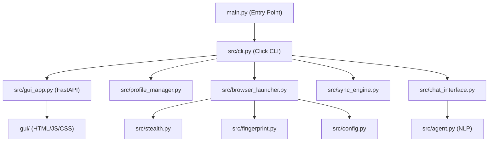

# Auto-Browser: Implementation Walkthrough

## What Was Built

A full CLI application for **multi-browser monitoring & automation** with 10 source files.

### Architecture



---

## Files Created/Modified

| File | Purpose |
|---|---|
| [main.py](main.py) | CLI entry point with banner |
| [src/cli.py](src/cli.py) | All Click commands + [gui](src/cli.py#424-485) launcher |
| [src/gui_app.py](src/gui_app.py) | FastAPI Backend API for GUI |
| [gui/index.html](gui/index.html) | Desktop Application Frontend Canvas |
| [gui/style.css](gui/style.css) | Dark-mode + Glassmorphism Styling |
| [gui/app.js](gui/app.js) | Frontend to Backend API interconnect |
| [src/config.py](src/config.py) | Config loading, path management |
| [src/profile_manager.py](src/profile_manager.py) | Profile CRUD + proxy + VPN info |
| [src/browser_launcher.py](src/browser_launcher.py) | Playwright browser launch with stealth |
| [src/stealth.py](src/stealth.py) | 10 anti-bot JS scripts |
| [src/fingerprint.py](src/fingerprint.py) | Random fingerprint generator |
| [src/sync_engine.py](src/sync_engine.py) | Root→follower action replay + Record Mode |
| [src/chat_interface.py](src/chat_interface.py) | Interactive chat with 20+ commands |
| [src/agent.py](src/agent.py) | Vietnamese/English NLP command parser |
| [requirements.txt](requirements.txt) | Dependencies |

---

## Key Features

### 1. Anti-Bot Stealth (10 techniques)
- `navigator.webdriver` removal
- Plugin spoofing (3 fake plugins)
- WebGL vendor/renderer spoofing
- Canvas fingerprint noise injection
- WebRTC IP leak prevention
- Chrome runtime mock
- Permissions API override
- Hardware concurrency/memory spoofing
- Language override
- iframe detection bypass

### 2. Browser Sync Engine & Action Recording
- Injects JS listeners into root browser capturing: click, input, scroll, keypress
- **Live Sync**: Replays via CSS selector matching on all followers
- **Record Mode**: Captures sequences to memory, exports them as executable Playwright/Browser scripts ([.js](gui/app.js)) inside `/scripts`

### 3. Proxy Authentication Support
- Allows integration of custom proxies bought from providers (HTTP/SOCKS5)
- Fully supports proxy authentication (Username and Password) passed dynamically to Playwright without requiring third-party VPN Extensions
- GUI profile creator includes Optional fields for Proxy Username and Proxy Password

### 4. Desktop GUI Layer (Webview)
- Powered by `fastapi` local endpoints bridging python backends to JS
- Hosted in `pywebview` Native Window wrapper
- Fully responsive dark-mode Glassmorphism UI
- Profile manager modals, real-time status indication, and script triggers

### 5. Chat Commands
[goto](src/sync_engine.py#249-254), [click](gui/app.js#208-220), `type`, `fill`, `press`, `scroll`, `screenshot`, `eval`, [script](src/gui_app.py#220-239), `wait`, [select](gui/app.js#89-94), [list](src/browser_launcher.py#196-198), [url](src/browser_launcher.py#38-46), `back`, `forward`, `reload`, [close](src/browser_launcher.py#168-179)

---

## Usage Examples

```bash
# === DESKTOP GUI MODE ===
# -----------------------------
python main.py gui
# -----------------------------

# === CLI MODE ===
# Profile management
python main.py profile create user01 --proxy socks5://127.0.0.1:1080
python main.py profile list
python main.py profile set-proxy user01 http://proxy:8080

# Launch browsers
python main.py launch user01 user02

# Sync mode (root controls followers)
python main.py sync start --root user01 -f user02 -f user03

# Interactive mode (launch + chat)
python main.py interactive user01 user02 --sync-root user01

# Chat with agent (Vietnamese/English)
python main.py chat --agent

# Run script on browsers
python main.py run auto_login.js --target user01
```

---

## Verification Results

| Test | Result |
|---|---|
| `python main.py --help` | ✅ All 7 commands shown |
| `profile create test1 --proxy socks5://...` | ✅ Profile dir + JSON created |
| `profile list` | ✅ Rich table displayed |
| `profile delete test1` | ✅ Profile removed |
| `profile.json` content | ✅ id, name, proxy, fingerprint, timestamps |
| Browser launch + stealth | ⏳ Requires manual test with display |
| Browser sync | ⏳ Requires manual test with 2+ browsers |
| Chat interface | ⏳ Requires running browsers |

> [!NOTE]
> Browser-related tests (launch, sync, chat) need to be run manually on your machine since they require a display and user interaction. Use the commands above to test.
